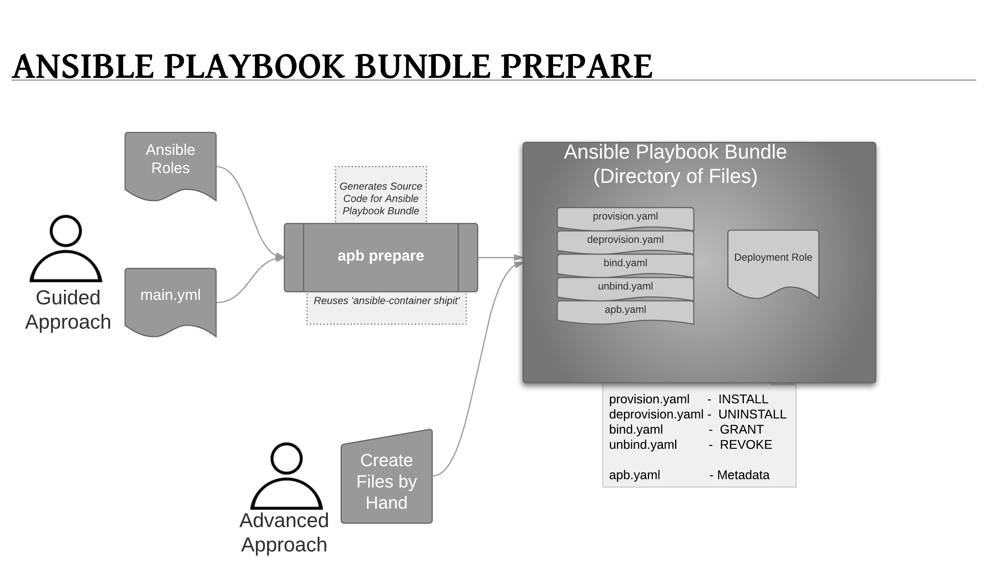
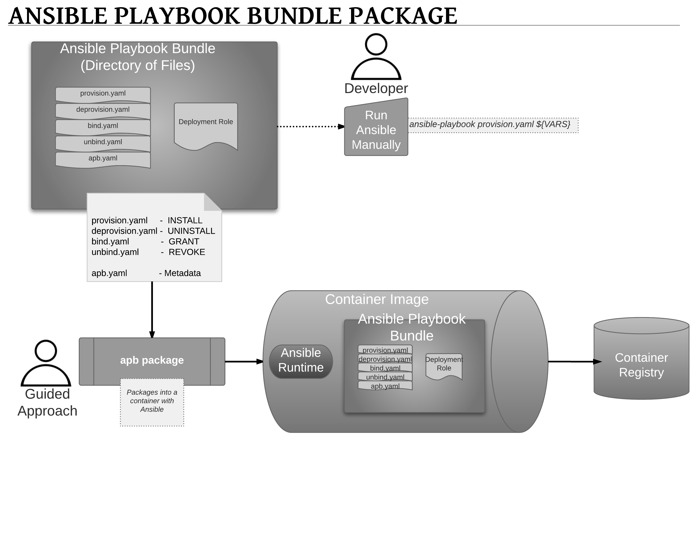
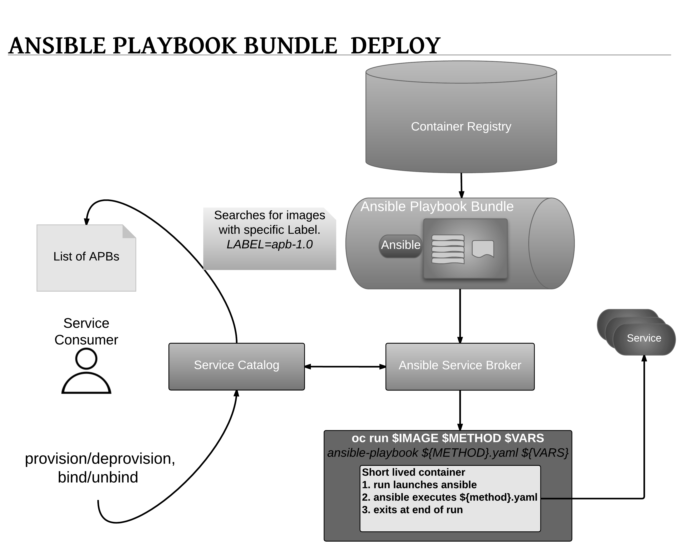

# Design

## Overview
An [Ansible Playbook Bundle (APB)](https://github.com/fusor/ansible-playbook-bundle)
borrows several concepts from the [Nulecule](https://github.com/projectatomic/nulecule)
or [Atomicapp](http://www.projectatomic.io/docs/atomicapp/) project, namely the concept of a short
lived container with the sole purpose of orchestrating the deployment of the intended application. For the case
of APB, this short lived container is the APB; a container with an Ansible runtime environment
plus any files required to assist in orchestration such as playbooks, roles, and extra dependencies.
Specification of an APB is intended to be lightweight, consisting of several named playbooks and a
metadata file to capture information such as parameters to pass into the application.

## Workflow
APB is broken up into the following steps.

  1. [Preparation](#preparation)
    * [APB init](#apb-initialization)
    * [Spec File](#spec-file)
    * [Actions](#actions) (provision, deprovision, bind, unbind)
  1. [Build](#build)
  1. [Deploy](#deploy)

### Preparation

#### APB Initialization

The first step to creating an APB is to run the `apb init` command, which will create the required skeleton directory structure, and a few required files (e.g. `apb.yml` spec file) for the APB.

##### Directory Structure
The following show an example directory structure of an APB.
```bash
example-apb/
├── Dockerfile
├── apb.yml
└── roles/
│   └── example-apb-openshift
│       ├── defaults
│       │   └── main.yml
│       └── tasks
│           └── main.yml
└── playbooks/
    └── provision.yml
    └── deprovision.yml
    └── bind.yml
    └── unbind.yml
```

#### Spec File

The `apb init` will create an example APB Spec `apb.yml` File as shown below:
```yml
name: my-apb
image: <docker-org>/my-apb
description: "My New APB"
bindable: false
async: optional
parameters: []
```

This spec file will need to be edited for your specific application.

The following is the spec file for `etherpad-apb`
```yml
name: apb/etherpad-apb
description: Note taking web application
bindable: true
async: optional
parameters:
  - name: hostport
    description: The host TCP port as the external endpoint
    type: int
    default: 9001
  - name: db_user
    description: Database User
    type: string
  - name: db_pass
    description: Database Password
    type: string
  - name: db_name
    description: Database Name
    type: string
  - name: db_host
    description: Database service hostname/ip
    default: mariadb
    type: string
  - name: db_port
    description: Database service port
    type: int
    default: 3306
```

##### Spec File Parameters
`parameters` section of the specfile; `ParameterObject` array

Field Name | Type | Required | Default | Description
---|---|---|---|---
name | string| yes |  | The name of the parameter.
required| bool | no | true | Whether or not the parameter is required.  If `false` and no default is provided, will be omitted from the parameters passed to the APB.
description | string | yes | | A human readable description of the parameter.
type | string | yes | | Type of parameter. `bool`, `int`, `float`, `string`, are valid
default | bool,int,float,string|  no | | An optional default value for the parameter.

#### Actions
The following are the actions for an APB. At a minimum, an APB must implement the `provision` and `deprovision` actions.
 * provision.yml
   * Playbook called to handle installing application to the cluster
 * deprovision.yml
   * Playbook called to handle uninstalling
 * bind.yml
   * Playbook to grant access to another service to use this service, i.e. generates credentials
 * unbind.yml
   * Playbook to revoke access to this service

The required named playbooks correspond to methods defined by the Open Service Broker API. For example, when the
Ansible Service Broker needs to `provision` an APB it will execute the `provision.yml`.

After the required named playbooks have been generated, the files can be used directly to test management of the
application. A developer may want to work with this directory of files, make tweaks, run, repeat until they are
happy with the behavior. They can test the playbooks by invoking Ansible directly with the playbook and any
required variables.

### Build
The build step is responsible for building a container image from the named playbooks for distribution.
Packaging combines a base image containing an Ansible runtime with Ansible artifacts and any dependencies required
to run the playbooks. The result is a container image with an ENTRYPOINT set to take in several arguments, one of
which is the method to execute, such as provision, deprovision, etc.



### Deploy
Deploying an APB means invoking the container and passing in the name of the playbook to execute along with any
required variables. It’s possible to invoke the APB directly without going through the Ansible Service Broker.
Each APB is packaged so it’s ENTRYPOINT will invoke Ansible when run. The container is intended to be short-lived,
coming up to execute the Ansible playbook for managing the application then exiting.

In a typical APB deploy, the APB container will provision an application by running the `provision.yml` playbook
 which executes a deployment role. The deployment role is responsible for creating the OpenShift resources,
 perhaps through calling `oc create` commands or leveraging Ansible modules. The end result is that the APB runs
 Ansible to talk to OpenShift to orchestrate the provisioning of the intended application.


